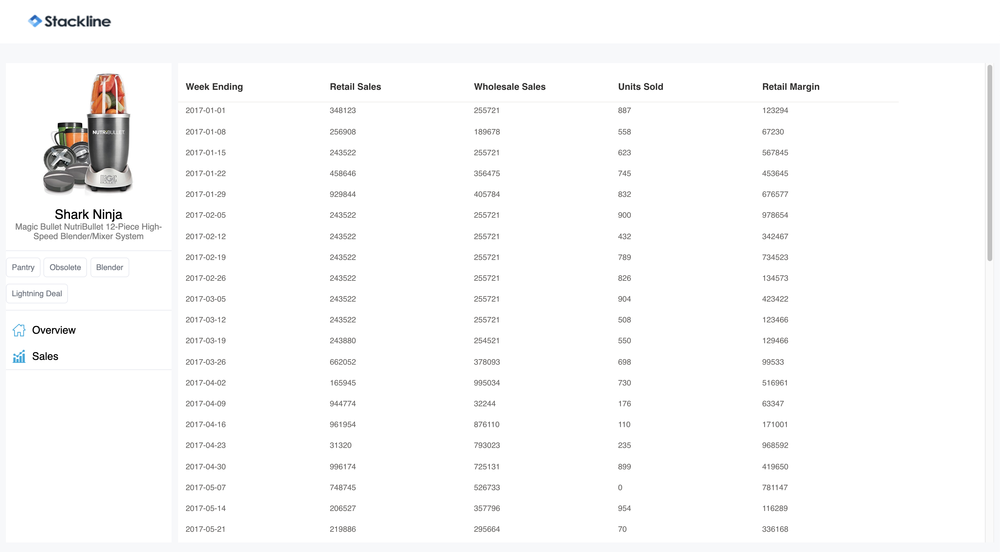

# Stackline Demo

## Running
Note: Ensure that you have the latest node and the latest npm installed before proceeding.
``` bash
npm install
npm run start
```

Running the above command should open a chrome window with the app running in it.

Enjoy!

## Features
- Using immer for easy updates of the store
- Using inversify for easy mock of services later
- Using separate history for easy management of history in app
- SCSS for good styling


## Areas of improvement
- Sorting in the table
- Rename some of the classes to be more meaningful
- Add loading indicator as the app is loading the content
- ADD TESTING
- Style text better
- Better architecture of the Redux store



## Contributing
Happy to collaborate, raise a PR or contact me at [yaser.ca](https://www.yaser.ca)
